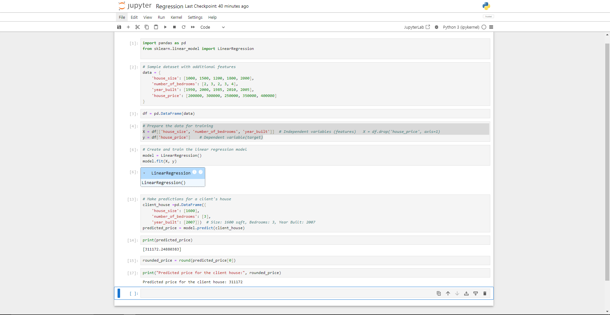

# Machine_Learning-Supervised_Learning-Linear_Regression

Machine Learning (ML) is a type of Artificial Intelligence (AI) that allows software applications or programs to become more accurate in predicting outcomes without being explicitly programmed to do so. Machine Learning algorithms use historical data as input to predict new output values.

Supervised learning is a type of Machine Learning of training a computer on a set of labeled data. This means that the data has been pre-classified, so the model knows what the correct output should be for each input.

Linear regression is a statistical technique used in machine learning to model the relationship between a dependent variable (the outcome we want to predict) and one or more independent variables (features or factors that influence the outcome). It assumes that the relationship between the variables can be approximated by a straight line.
## Diagram


Lets say you are a House valuer finding the price of a client's house. You have a dataset that includes information about several houses, such as the size of the house (in square feet), the number of bedrooms, and the age of the house. You also have the corresponding prices at which each house was sold.

Linear regression works by finding a straight line (a mathematical equation) that best fits the relationship between the features (size, bedrooms, age) and the house prices. The goal is to find a line that minimizes the difference between the actual house prices and the predicted prices given by the line.

Here is a code snippet of a linear regression model that predict the price of house. Play around with the client_house features and see how the predicted house price changes.

```python
import pandas as pd
from sklearn.linear_model import LinearRegression

# Sample dataset with additional features
data = {
    'house_size': [1000, 1500, 1200, 1800, 2000],
    'number_of_bedrooms': [2, 3, 2, 3, 4],
    'year_built': [1990, 2000, 1985, 2010, 2005],
    'house_price': [200000, 300000, 250000, 350000, 400000]
}

df = pd.DataFrame(data)

# Prepare the data for training
X = df[['house_size', 'number_of_bedrooms', 'year_built']]  # Independent variables (features)   X = df.drop('house_price', axis=1)
y = df['house_price']    # Dependent variable(target)

# Create and train the linear regression model
model = LinearRegression()
model.fit(X, y)

# Make predictions for a client's house
client_house =pd.DataFrame({
    'house_size': [1600],
    'number_of_bedrooms': [3],
    'year_built': [2007]})  # Size: 1600 sqft, Bedrooms: 3, Year Built: 2007
predicted_price = model.predict(client_house)

rounded_price = round(predicted_price[0])

print("Predicted price for the client house:", rounded_price)
```
## Output

